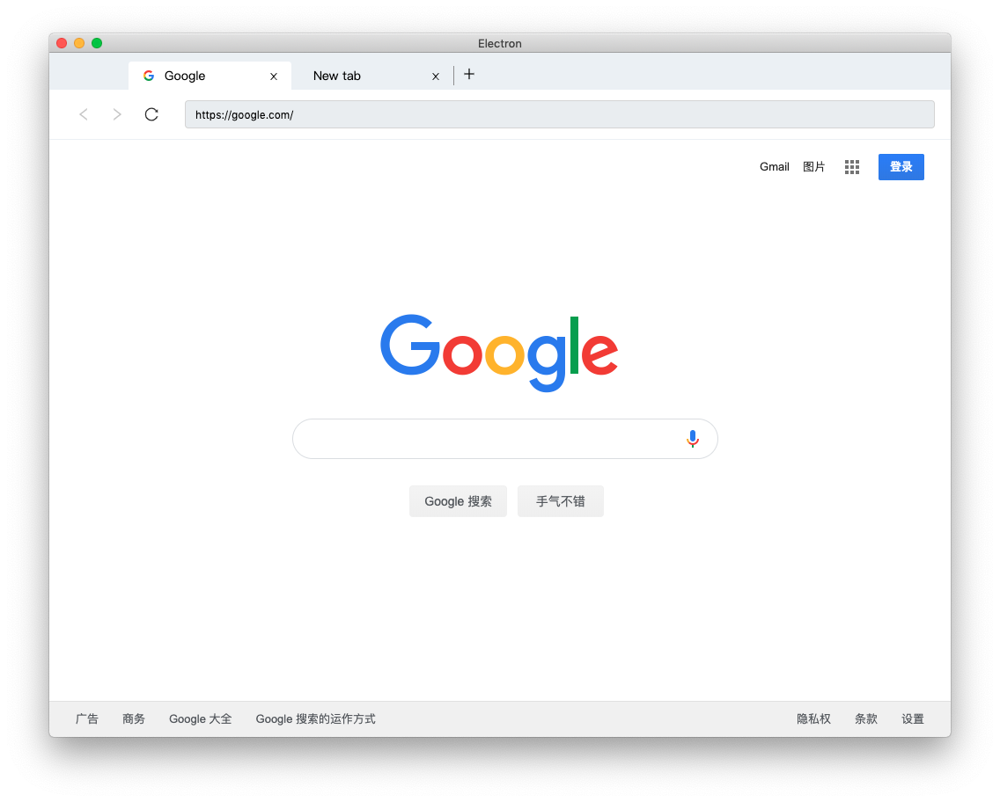

# electron-as-browser

A node module to help build	browser like windows in electron.

## Features

-   Made with [BrowserView](https://electronjs.org/docs/api/browser-view) instead of [webview](https://electronjs.org/docs/api/webview-tag)
-   Pluggable control panel (Navigation interface)
-   Exposed [webContents](https://electronjs.org/docs/api/web-contents) and [BrowserWindow](https://electronjs.org/docs/api/browser-window)
-   Tricky auto resize just out of the box

## Install

`npm i electron-as-browser`

### Run Example

- yarn install
- yarn start:control
- yarn start

## [API](https://hulufei.github.io/electron-as-browser/)
